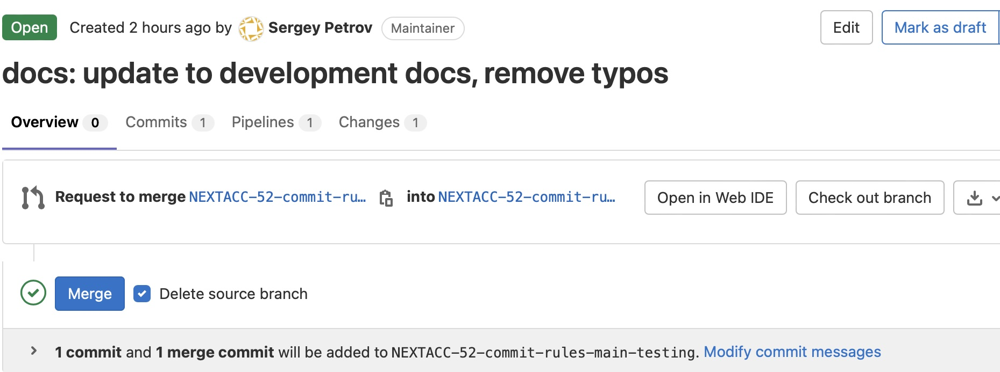
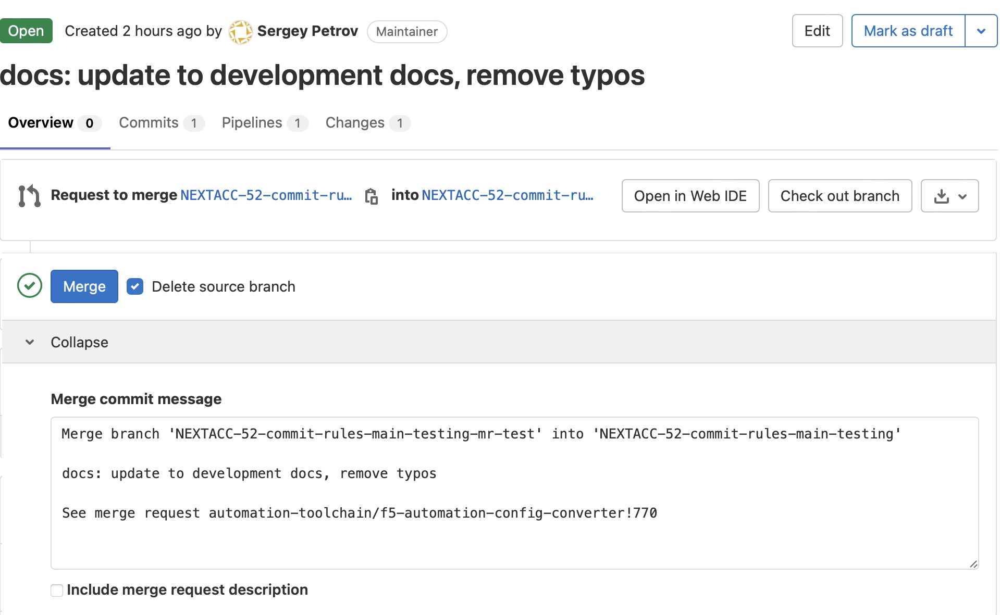
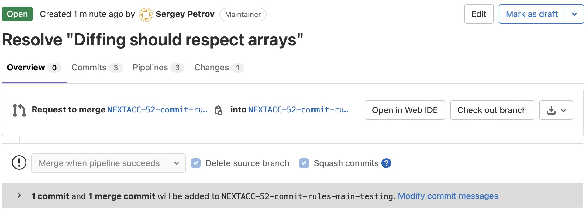
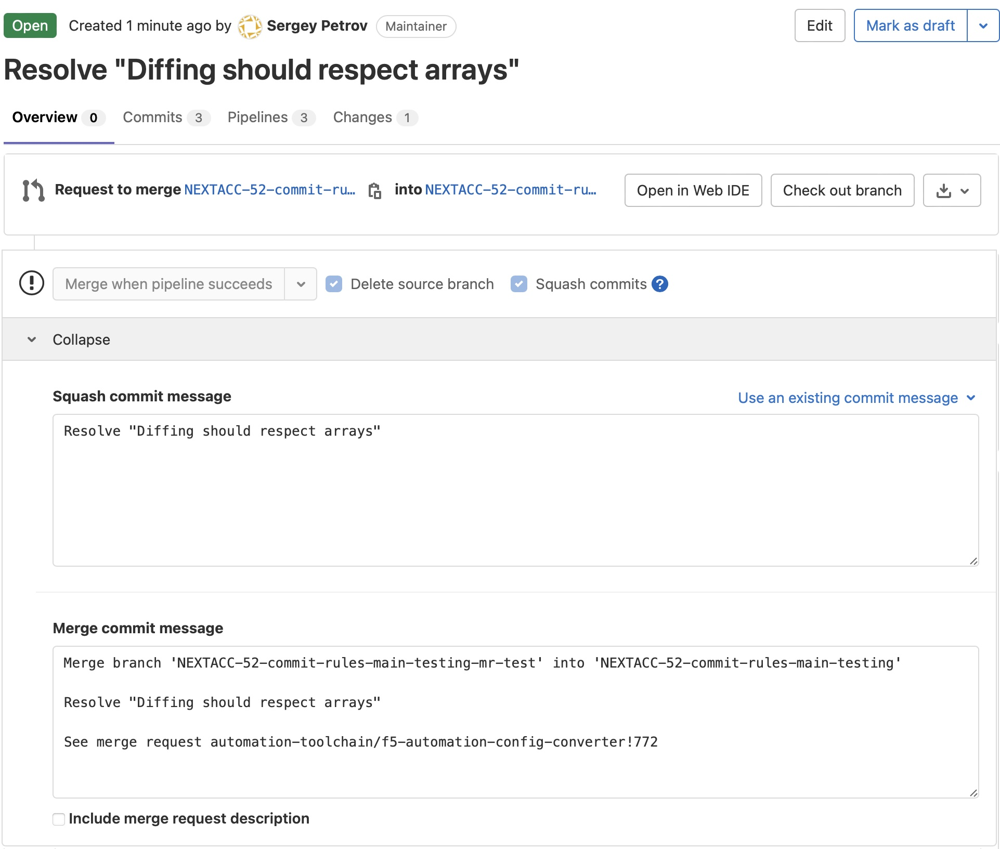

# Development documentation

[[_TOC_]]

## Developer Environment

### Setup
Developers should use the latest stable node (lts) + npm versions.
This can be done using Node Version Manager (`nvm`). Installation and usage instructions [here](https://github.com/nvm-sh/nvm)
Once nvm is installed, you can run command below to use the latest.

```shell
 nvm install --lts --latest-npm
```

Install all node.js packages to make `commitlint` available for usage.

```shell
npm install
```

### Local enforcement for the comment style rules (commitlint)

`commitlint` utility can help to make the process easier to follow:

```shell
# add files
git add .
# run utility in interactive mode
npx commit
# ready to push (if need)
git push
```

## Conventional Changelog and Commits

The Conventional Commits specification is a lightweight convention on top of commit messages. It provides an easy set of rules for creating an explicit commit history; which makes it easier to write automated tools on top of. This convention dovetails with SemVer, by describing the features, fixes, and breaking changes made in commit messages.

### Goals

- allow generating CHANGELOG.md by script
- provide better information when browsing the history


### Commit message structure

A commit message consists of a **header**, a **body** and a **footer**, separated by a **blank line**:

```
<header>
<BLANK LINE>
<body>
<BLANK LINE>
<footer>
```

**NOTE**:

- **header** is **MANDATORY**
- **body** and **footer** are **OPTIONAL**
- Any **line** (yes, you can write multi-line commit message) of the commit message cannot be longer 100 characters! This allows the message to be easier to read on GitLab/Jira as well as in various git tools

#### \<header>

The message header is a single line that contains succinct description of the change containing a **type**, **scope** and **subject**.

```
<type>(<scope>): <subject>
```

- `type` - (**REQUIRED**) is used to determine if the commit should cause a patch or minor bump
- `scope` - (**OPTIONAL**) is used to determine what part of your application was affected by the change (e.g. `ci`, `build`, `core` and etc.)
- `subject` - (**REQUIRED**) are included in the release note if the type indicates a version bump

#### \<body>

Just as in the subject, use the imperative, present tense: "change" not "changed" nor "changes". The body should include the motivation for the change and contrast this with previous behavior.

#### \<footer>

The footer should contain any information about **Breaking Changes** and is also the place to reference Bugzilla/GitLab/Jira issues that this commit **Closes**.

**Breaking Changes** should start with the word **BREAKING CHANGE:** with a space or two newlines. The rest of the commit message is then used for this.

### Conventional Commits Agreement

#### General

- The **subject** contains a succinct description of the change:
	- use the imperative, present tense: "change" not "changed" nor "changes"
	- don't capitalize the first letter
	- no dot (.) at the end
- The **body** should:
	- use the imperative, present tense: "change" not "changed" nor "changes"
	- should include the motivation for the change and contrast this with previous behavior
- The **footer** should contain a closing reference to an issue if any
- **Breaking Changes:**
	- should start with the word **BREAKING CHANGE:** with a space or two newlines

#### Types

**NOTE**: If you need to ensure the commit automatically triggers a release and added to changelog, you may need to use a different keyword rather than sticking to the definitions below. See [Version bumps](#version-bumps)

Allowed types:

- `build` - changes that affect the build system or external dependencies (if updating base images, use `feat` instead)
- `chore` - version bump, maintenance and etc.
- `ci` - changes to CI configuration files and scripts
- `docs` - documentation only chanes
- `feat` - a new feature to the codebase
- `fix` - patches a bug in the codebase
- `perf` - a code change that improves performance
- `refactor` - a code change that neither fixes a bug nor adds a feature (e.g. deps updated)
- `revert` - reverts a previous commit
- `style` - changes that do not affect the meaning of the code (white-space, formatting, missing semi-colons, etc.)
- `test` - adding missing tests or correcting existing tests

Please, ask the team if you don't know which one to use.

#### Version bumps

- Major bumps (changes **X** in x.y.z):
	- `BREAKING CHANGE:`
- Minor bumps (changes **Y** in x.y.z):
	- `feat`
- Patch bumps (changes **Z** in x.y.z):
	- `fix`
	- `perf`
	- `refactor`
- No bumps:
	- `build`
	- `chore`
	- `ci`
	- `docs`
	- `revert`
	- `style`
	- `test`

#### Breaking changes

When a commit contains a breaking change, the commit message should contain `BREAKING CHANGE:` to trigger a major version bump.

For example:

```
refactor: unify flag naming

BREAKING CHANGE: Flags corresponding with CI_ env-vars are prefixed with 'ci-'

- project-path -> ci-project-path
- project-url -> ci-project-url
- commit-sha -> ci-commit-sha
- commit-tag -> ci-commit-tag
- commit-ref-name -> ci-commit-ref-name
```

- The text after `BREAKING CHANGE:` is included in the release note

**NOTE:** About breaking changes:

```
Try to avoid introducing breacking chages as long as possible.
Keep in mind following:
- minor chages are UPDATEs and costs almost nothing to the end-user
- breaking changes are UPGRADEs and usually costs a lot more for the end user
```

#### Footer

The footer should contain any information about **Breaking Changes** and is also the place to reference GitLab/Jira issues that this commit **Closes**.

**Breaking Changes** should start with the word **BREAKING CHANGE:** with a space or two newlines. The rest of the commit message is then used for this.

#### Revert

If the commit reverts a previous commit, its header should begin with `revert: `, followed by the header of the reverted commit. In the body it should say: `This reverts commit <hash>`, where the hash is the SHA of the commit being reverted.

#### Referencing issues

Closed bugs/issues should be listed on a separate line in the **footer** prefixed with **Closes** keyword like this:

```
Closes ISSUE-UNIQUE-ID
```

or in case of multiple issues:

```
Closes ISSUE-UNIQUE-ID-1, ISSUE-UNIQUE-ID-2, ISSUE-UNIQUE-ID-3
```

If the commit message has no **footer** section, then following format is acceptable:

```
fix(core): [ISSUE-UNIQUE-ID] declaration should be validate before saving it to the storage
```

### Examples

##### Fixes

Commit message:

```
refactor(actions): switch to using actions api
```

Will appear in release note in **Fixes** section like this:

> **actions**: switch to using actions api ([65d00257](65d00257))

##### Features

Commit message:

```
feat(next-version): [ISSUE-UNIQUE-ID] add flag to return curr-ver if no changes detected
    
Fixes #38
```

Will appear in release note in Features section like this:

> **next-version**: [ISSUE-UNIQUE-ID] add flag to return curr-ver if no changes detected ([80895de9](80895de9))

##### Breaking changes

Commit message:

```
refactor: unify flag naming

BREAKING CHANGE: Flags corresponding with CI_ env-vars are prefixed with 'ci-'

- project-path -> ci-project-path
- project-url -> ci-project-url
- commit-sha -> ci-commit-sha
- commit-tag -> ci-commit-tag
- commit-ref-name -> ci-commit-ref-name
```

Will appear in Breaking changes section like this:

> unify flag naming (69485bc0)
>
> Flags corresponding with CI_ env-vars are prefixed with ‘ci-’
>
> - project-path -> ci-project-path
> - project-url -> ci-project-url
> - commit-sha -> ci-commit-sha
> - commit-tag -> ci-commit-tag
> - commit-ref-name -> ci-commit-ref-name

### Additional information

Links to read additional information (optional):

- [https://www.conventionalcommits.org/en/v1.0.0/](https://www.conventionalcommits.org/en/v1.0.0/)
- [https://juhani.gitlab.io/go-semrel-gitlab/](https://juhani.gitlab.io/go-semrel-gitlab/)
- [https://semver.org](https://semver.org)
- [https://github.com/angular/angular/blob/22b96b9/CONTRIBUTING.md#-commit-message-guidelines](https://github.com/angular/angular/blob/22b96b9/CONTRIBUTING.md#-commit-message-guidelines)
- [https://tbaggery.com/2008/04/19/a-note-about-git-commit-messages.html](https://tbaggery.com/2008/04/19/a-note-about-git-commit-messages.html)
- [https://365git.tumblr.com/post/3308646748/writing-git-commit-messages](https://365git.tumblr.com/post/3308646748/writing-git-commit-messages)


## Local development

The developer want to merge branches localy then following workflow should work:

```
git add <add-changed-files>
git commit -m "chore: removed extra dot"
...
git add <add-changed-files>
git commit -m "fix: fixed the bug"

git checkout main
git merge --squash feature
git commit -m "fix: new feautre"
```

## GitLab Push and Pipeline Runs

The first time you push a local branch to GitLab, a branch pipeline will be created. A branch pipeline will run some of the jobs, depending on type of files changed. Refer to the [GitLab CI file for details on which jobs are run](../.gitlab-ci.yml)

In subsequent commits/push:
  - if push is without a merge request(MR) opened, the pipeline created will be a branch pipeline (runs on the source branch)
  - once a merge request(MR) is opened, the pipeline created for a new push to the branch will be a merge request pipeline (runs on a simulated merge of source and target)

A typical workflow then will be:
  - During early development stages or if you want to make a number of incremental commits and execute the basic/minimal checks, do push your branch but don't open an MR yet. The pipeline for the subsequent commits after the first push will most likely finish faster as there'd be less number of jobs to execute.
  - When you are getting ready to wrap up deveopment, or whenever you want the pipelines to run with maximum coverage and verify that merging your branch to target will pass all the checks, then you can open an MR.

## GitLab Merge Requests

Prerequisite:
- Every merge creates a merge commit
- Squash commits when merging

**ATTENTION:**

Once MR created it is better to set the title to follow the style.

### Single commit in `feature` branch

The developer made **one commit only** to `feature` branch and is ready to create Merge Request in **GitLab** WEB UI to merge `feature` to `main`.

Commit history in `feature` branch look like following (top is most recent):

```
2ab1bd7a docs: update to development docs, remove typos
```

One commit only. Then the developer created Merge Request in GitLab with title `Resolve "Additional documentation for the feature"` (by default in this particular case GitLab Web UI will use that commit message as a title for merge request).

The merge request has only 1 commit it total, so Web UI will look like following:



Click on **Modify commit messages** at the botton and you will see following:



Due `feature` branch has only 1 commit in total comparing to the `main` there is no **squash commit message**, the commit message will be used instead.

Once the developer hit **Merge** button 2 commit messages will be created on `main`:

```
3cbebf8b Merge branch 'feature' into 'main'
2ab1bd7a docs: update to development docs, remove typos
```

Commit `2ab1bd7a` is **compatible** with Conventional Commits style and will be used to generate the changelog if needed.
Commit `3cbebf8b` is NOT compatible with Conventional Commits style and will be ignored on attempt to generate the changelog.

### Multiple commits in `feature` branch

The developer made **multiple commits** to `feature` branch and is ready to create Merge Request in **GitLab** WEB UI to merge `feature` to `main`.

Commit history in `feature` branch look like following (top is most recent):

```
863b9d7c fix: update object diffing to support arrays
bddda339 build(ci): update CI config to run unit tests in parallel
2ab1bd7a docs(dev): update to development docs, remove typos
```

Then the developer created Merge Request in GitLab with title `Resolve "Diffing should respect arrays"`.

**HINT:**

If MR's title follow Conventional Commit style then **Squash commit message** will follow as well too.

The merge request has multiple commits, so Web UI will look like following:



Click on **Modify commit messages** at the botton and you will see following:



Now **Squash commit message** is available in addition to **Merge commit message**. To follow Conventional Commits style **Squash commit message** has to be update with something like following:

```
fix: update diff algo to respect arrays
```

Once the developer hit **Merge** button 2 commit messages will be created on `main`:

```
3cbebf8b Merge branch 'feature' into 'main'
2ab1bd7a fix: update diff algo to respect arrays
```

Commit `2ab1bd7a` is **compatible** with Conventional Commits style and will be used to generate the changelog if needed.
Commit `3cbebf8b` is NOT compatible with Conventional Commits style and will be ignored on attempt to generate the changelog.


## Project Specific (ACC)

### GitLab configuration for the repo

- "Settings -> General -> Merge Requests -> Merge Checks -> All discussions must be resolved" - enable the option
- "Settings -> General -> Merge Requests -> Squash commit message template" - set to:

```
%{title}
```

- "Settings -> Repository -> Push Rules -> Require Expression in commit messages" - set to:

```
^(?:(?:build|chore|ci|docs|feat|fix|perf|refactor|revert|style|test)\s*(?:\([^()]+)\)?\s*:\s*\S+)|(?:Merge branch)
```

**NOTE:**

- GitLab doesn't verify **Squash commit message** matches **Push rules**. Only **Merge commit message** is being verified.
