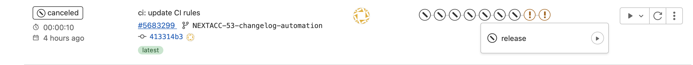

# ACC Release Process

## Automated release

Thanks to Semantic Versioning and Conventional Commits releases can be produced in autonomous way.
These are configured in our [release](../scripts/release) and [ci scripts](../scripts/misc/ci-scripts-lib).

To ensure that the commits can be used to trigger an automatic release job, review the [development section on Commit Types and Version Bumps.](development.md#types)

### Regular releases

Once the `main` branch updated due to merged Merge Request or push commit (actually should be prohibited) then
`release` job executed automatically and it is responsible for version bump and changelog update.
If `release` detected that the version needs to be bumped then:

1. As result of `release` job execution following files were updated:

    - [CHANGELOG.md](CHANGELOG.md)
        - new changelog entries with information about new feature and fixed issues
    - [package.json](package.json)
        - `version` set to `X.Y.Z`
        - commit SHA under the `githash` key
    - [package-lock.json](package-lock.json)
        - `version` set to `X.Y.Z`
        - commit SHA under the `githash` key

2. As result of `release` job execution following tags and releases created:

    - `vX.Y.Z` tag - most recent version on top of `main` branch
    - `vX.Y.Z` release with release notes from [CHANGELOG.md](CHANGELOG.md)
    - `latest` tag - most recent version on top of `main` branch
    - `latest` release - points to most recent release

3. As result of `release` job execution several pipelines were executed for:

    - `vX.Y.Z` tag
        - `f5-automation-config-converter/f5-automation-config-converter-vX.Y.Z-source.tar.gz` - archive with the source code uploaded to Artifactory
        - `f5-automation-config-converter/f5-automation-config-converter-vX.Y.Z.tar.gz` - archive with the Docker image uploaded to Artifactory
        - `f5-automation-config-converter:vX.Y.Z` - Docker image published to Artifactory Image Registry

    - `latest` tag
        - `f5-automation-config-converter/f5-automation-config-converter-latest-source.tar.gz` - archive with the source code uploaded to Artifactory
        - `f5-automation-config-converter/f5-automation-config-converter-latest.tar.gz` - archive with the Docker image uploaded to Artifactory
        - `f5-automation-config-converter:latest` - Docker image published to Artifactory Image Registry

**NOTE:** Docker image based on the source code package

### Development builds

If there is a request to provide a dev build for testing or whatever then `release` job can be triggered manually from a `feature` branch most recent pipeline.

Manual job start (click to view)

1. As result of `release` job execution following files were updated:

    - [package.json](package.json)
        - `version` set to `X.Y.Z-dev.A+feature-branch`
        - commit SHA under the `githash` key
    - [package-lock.json](package-lock.json)
        - `version` set to `X.Y.Z-dev.A+feature-branch`
        - commit SHA under the `githash` key

2. As result of `release` job execution following tags and releases created:

    - `vX.Y.Z-dev.A+feature-branch` tag - where `A` is a build sequence number
    - `vX.Y.Z-dev.latest+feature-branch` tag - latest dev build

3. As result of `release` job execution several pipelines were executed for:

    - `vX.Y.Z-dev.A+feature-branch` tag
        - `f5-automation-config-converter/f5-automation-config-converter-vX.Y.Z-dev.A-feature-branch-source.tar.gz` - archive with the source code uploaded to Artifactory
        - `f5-automation-config-converter/f5-automation-config-converter-vX.Y.Z-dev.A-feature-branch.tar.gz` - archive with the Docker image uploaded to Artifactory
        - `f5-automation-config-converter:vX.Y.Z-dev.A-feature-branch` - Docker image published to Artifactory Image Registry

    - `vX.Y.Z-dev.latest+feature-branch` tag
        - `f5-automation-config-converter/f5-automation-config-converter-vX.Y.Z-dev.latest-feature-branch-source.tar.gz` - archive with the source code uploaded to Artifactory
        - `f5-automation-config-converter/f5-automation-config-converter-vX.Y.Z-dev.latest-feature-branch.tar.gz` - archive with the Docker image uploaded to Artifactory
        - `f5-automation-config-converter:vX.Y.Z-dev.latest-feature-branch` - Docker image published to Artifactory Image Registry

### Hotfix builds

WILL BE SUPPORTED LATER ONCE `go-semrel-gitlab` UTILITY UPDATED AND IF IT WILL BE NEEDED

### RC builds

WILL BE SUPPORTED LATER ONCE `go-semrel-gitlab` UTILITY UPDATED AND IF IT WILL BE NEEDED

### Custom builds

Just create a tag and image publising will be done using the tag/ Similar to development builds but without changelog generation and version bumps.

Links to read additional information (optional):

- [https://www.conventionalcommits.org/en/v1.0.0/](https://www.conventionalcommits.org/en/v1.0.0/)
- [https://juhani.gitlab.io/go-semrel-gitlab/](https://juhani.gitlab.io/go-semrel-gitlab/)
- [https://semver.org](https://semver.org)

## Internal Release Announcement Email

After the release tag created (by 'release' job, runs on 'main' branch only), send an internal release announcement email.

NOTE: While working in feature branch the 'release' job can be run manually in case dev build is needed for some reason.

### Recipients
* acc_dev
* Journeys
* Ben Gordon
* Pawel Purc

### Boilerplate Content

ACC v1.X.X is now available.
If you have comments or concerns, please send an email to solutionsfeedback@f5.com

### Links Content

* Link to artifactory source tarball, can be grabbed from `publish_image` job artifacts
* Link to GitLab release page

### Dynamic Content

* Cut and paste the contents of GitLab release text with
    * Version
    * Added
    * Fixed
    * Changed
    * Removed

## Notify Release Manager that the release is ready

* The Release Manager will publish to:
    * GitHub
    * DockerHub
